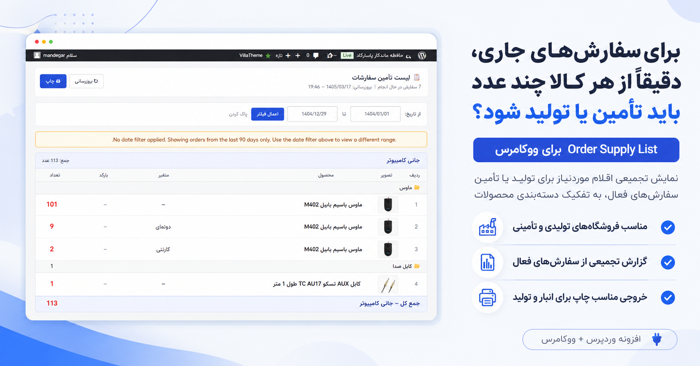
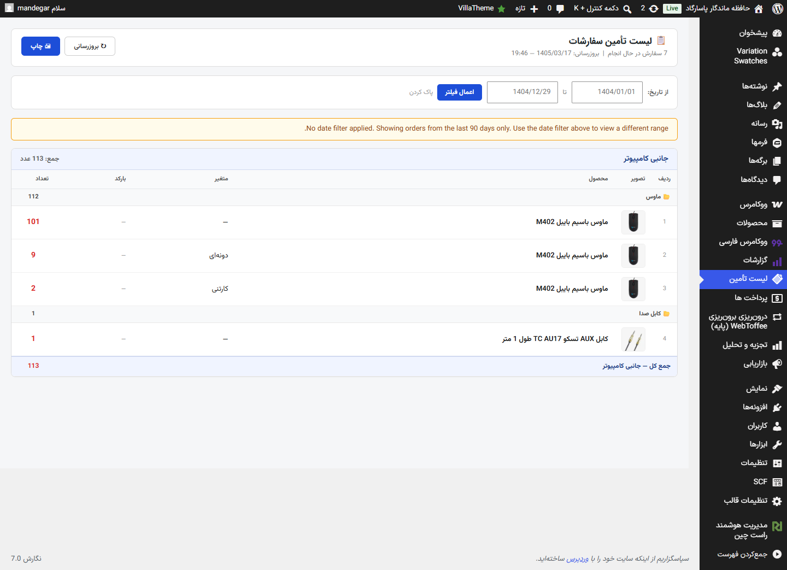

# Order Supply List for WooCommerce

Order Supply List یک افزونه مدیریتی برای ووکامرس است که به مدیران فروشگاه کمک می‌کند تا به سرعت متوجه شوند برای **سفارش‌های جاری** از هر محصول چه تعداد باید تولید یا تأمین شود.

این افزونه مخصوص فروشگاه‌های تولیدی یا تأمینی است که نیاز دارند سفارش‌ها را به یک **لیست عملیاتی قابل استفاده برای تولید و تأمین** تبدیل کنند.

---

## ویژگی‌ها

- نمایش تجمیعی سفارش‌های فعال ووکامرس
- نمایش تعداد هر محصول بر اساس دسته‌بندی
- پشتیبانی از محصولات متغیر ووکامرس
- فیلتر تاریخ
- پشتیبانی از تقویم شمسی در محیط فارسی
- پشتیبانی از تقویم میلادی در محیط انگلیسی
- خروجی مناسب چاپ برای تیم تولید یا انبار

---

## پیش‌نیازها

- WordPress 6.0 یا بالاتر
- WooCommerce 7.0 یا بالاتر
- PHP 7.4 یا بالاتر

---

## نصب و فعال‌سازی

1. فایل ZIP افزونه را دانلود کنید.
2. از مسیر `افزونه‌ها > افزودن > بارگذاری افزونه` فایل ZIP را آپلود کنید.
3. افزونه را فعال کنید.
4. در منوی WooCommerce > لیست تأمین می‌توانید گزارش‌ها را مشاهده کنید.

---

## نحوه استفاده

1. بازه تاریخ مورد نظر را وارد کنید (در فارسی شمسی، در انگلیسی میلادی).
2. دکمه "اعمال فیلتر" را بزنید.
3. گزارش تجمیعی نمایش داده می‌شود:
   - محصولات بر اساس دسته‌بندی
   - تعداد کل برای هر محصول
   - محصولات متغیر
4. می‌توانید خروجی را چاپ کرده و به تیم تولید یا انبار ارائه دهید.

---

## تصاویر نمونه

---

## نصب محلی Jalali Date Picker

- فایل‌های `jalalidatepicker.min.js` و `jalalidatepicker.min.css` در پوشه `assets/` موجود هستند و به صورت لوکال لود می‌شوند.
- فقط در محیط فارسی فعال می‌شوند.

---

## پشتیبانی

برای هرگونه سوال یا پیشنهاد، لطفاً ایمیل بزنید به:

`arminjamali21@gmail.com`
---
https://aryabyte.ir
---

## مجوز

این افزونه تحت **GPLv2 یا بالاتر** منتشر شده است.
